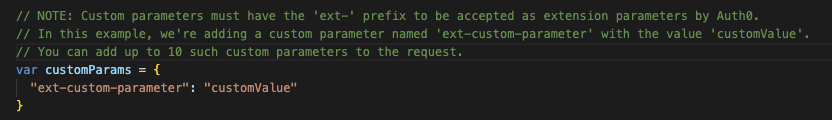
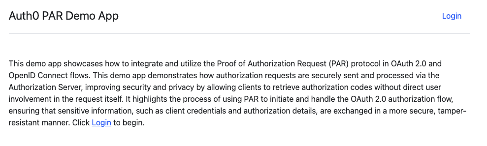

# Auth0 Pushed Authorization Requests (PAR) Demo Application

This is a sample application that demonstrates how to use Auth0's **Pushed Authorization Requests (PAR)** endpoint during the authorization code flow process.

## Disclaimer :warning:
This project serves as a **demo application** that you can modify or completely repurpose according to your needs.

## Assumptions
This project assumes you have a basic understanding of the **Auth0 Platform** and OAuth 2.0 concepts.

## Prerequisites

Before setting up the demo, ensure you have the following:

- **Auth0 Tenant**: If you don’t already have an Auth0 tenant, you can register for a free [Auth0 Free Plan](https://auth0.com/signup).
- **Enable PAR** on your Auth0 Tenant: Follow the [step-by-step guide](https://auth0.com/docs/get-started/applications/configure-par) to enable PAR.
- **Create a Regular Web App** in Auth0: Follow the instructions for creating a regular web app on Auth0's platform [here](https://auth0.com/docs/get-started/auth0-overview/create-applications/regular-web-apps).
- **Node.js v20.15.0+** and **npm v10.9.1+** installed.

## Demo Setup Steps

### 1. Clone the repository
Clone this repository to your local machine using the following command:

```bash
git clone https://github.com/intheorysecurity/auth0-par-demo.git
```

### 2. Install Node.js dependencies
Navigate into the project directory and install the necessary dependencies:

```bash
cd auth0-par-demo
npm install
```

### 3. Configure environment variables
Copy the contents of the `.env.example` file to create a new `.env` file. This file will store your environment-specific variables.

For **Windows**:
```bash
copy .env.example .env
```

For **Linux/macOS**:
```bash
cp .env.example .env
```

### 4. Update environment variables
Open the `.env` file and update the following variables:

```bash
AUTH0_DOMAIN="your-auth0-domain"
AUDIENCE="your-api-audience"
CLIENT_ID="your-client-id"
CLIENT_SECRET="your-client-secret"
```

### 5. Save the `.env` file

### 6. (Optional) Add Custom Authorization Parameters
If you want to send custom authorization parameters during the authentication flow, you can modify the `login.js` file located in the `routes` directory.

In the `customParams` variable, you can add any additional parameters you want to include in the authorization request:



### 7. (Optional) Include Custom Parameters in Access Token
To include the custom authorization parameters in the user’s access token, you will need to create a post-login action. For instructions, refer to the [Create An Action](https://auth0.com/docs/customize/actions/write-your-first-action#create-an-action) documentation.

This demo includes a sample post-login action, `update-user-accesstoken.js`, located in the `action` directory. You can modify this action as needed.

### 8. Start the application
Once everything is configured, run the following command to start the demo application:

```bash
npm start
```

### 9. Verify the application is running
If you see the message **"Server running on port 3000"** in your terminal, the application has started successfully.

Navigate to [http://localhost:3000](http://localhost:3000) in your browser to access the app.

### 10. Login and authenticate
On the application’s page, click **Login**, then authenticate with your Auth0 credentials.


## Contributing

Contributions are welcome! If you’d like to propose a major change, please open an issue to discuss the change first.

Please ensure to update tests as needed when submitting pull requests.

## License
This project is licensed under the [MIT License](https://choosealicense.com/licenses/mit/).
